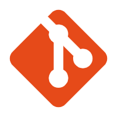

# Hello there! 👋🏻 I am Cassianvale ! 

Hello, I'm Cassianvale, a dedicated quality assurance engineer from China, who has pursued learning independently.

Superstitious new tools and methods,
Adhere to criticism and self-criticism, keep an open attitude to every opportunity, and have the courage to try new things.

- 😀 ask me about anything, I am happy to help;

**My devices：**
- 🍎&nbsp;Mac: 
    - MacBookAirM2 16G+512G
- 🖥️&nbsp;Windows: 
    - MSIZ690 + Intel12700KF + RTX3090X + OLOy32G
- &nbsp;Monitor: 
    - ASUS VG27AQL1A 27-inch 2k 177hz
    - WESCOM IPS 31.5-inch 4k
- 📱&nbsp;Phone: 
    - XiaoMi13 12G+256G
- 📽️&nbsp;Projector: 
    - JMGO N1S Pro 4K
 

**Languages and tools:**  

<code></code>
<code></code>
<code></code>
<code></code>
<code></code>
<code></code>
<code></code>
 
 

## 今年汇总 ✨
 

 
* 🌐 中文 · English
 
* ⏰ 09:00 - 02:00 <a href="https://time.is/UTC+8">「UTC+8」</a>
