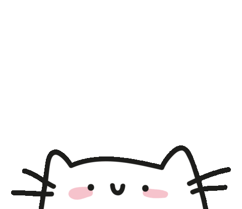
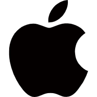
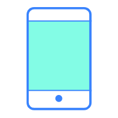

# Hello there! 👋🏻 I am Cassianvale ! 

<h3> 🙎 Cassian Vale | 💻 Test Development Engineer | 🛸 CN 
</h3>

<h4>Hello, I'm Cassianvale, a dedicated quality assurance engineer from China, who has pursued learning independently.</h4>

Superstitious new tools and methods,
Adhere to criticism and self-criticism, keep an open attitude to every opportunity, and have the courage to try new things.

### - My devices

- &nbsp;Mac: 
  - MacBookAirM2 16G+512G
- &nbsp;Windows: 
  - MSIZ690 + Intel12600KF + RTX3090 + OLOyDDR4 32G
  - Minisforum i5-13500H Hyper-v
- &nbsp;Monitor: 
  - ASUS VG27AQL1A 27-inch 2k 177hz
  - WESCOM IPS 31.5-inch 4k
- &nbsp;Phone: 
  - XiaoMi13 12G+256G
- &nbsp;Projector: 
  - JMGO N1S Pro 4K
   

### - Languages and Tools

    
    
    
    
    
    
    
     
    
    
    
    
    
    

 
 

## 今年汇总 ✨

 

 
* 🌐 中文 · English
 
* ⏰ 09:00 - 02:00 <a href="https://time.is/UTC+8" class="no-underline">「UTC+8」</a>
 
<h1 align='center'>⚡️<i>Stay awesome!</i>⚡️</h1>

        

